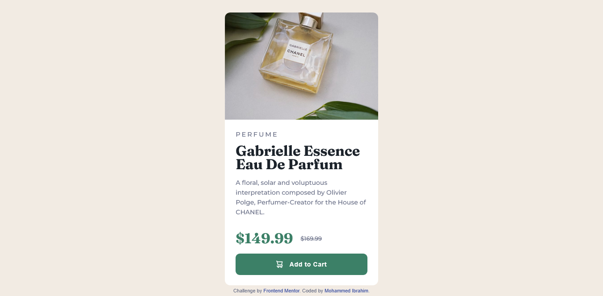

# Frontend Mentor - Product Preview Card Component Solution

This is a solution to the [Product Preview Card Component Challenge on Frontend Mentor](https://www.frontendmentor.io/challenges/product-preview-card-component-GO7UmttRfa). Frontend Mentor challenges help you improve your coding skills by building realistic projects.

## Table of Contents

- [Overview](#overview)
  - [The Challenge](#the-challenge)
  - [Screenshot](#screenshot)
  - [Links](#links)
- [My Process](#my-process)
  - [Built With](#built-with)
  - [What I Learned](#what-i-learned)
  - [Continued Development](#continued-development)
  - [Useful Resources](#useful-resources)
- [Author](#author)

## Overview

### The Challenge

Users should be able to:

- View the optimal layout depending on their device's screen size
- See hover and focus states for interactive elements

### Screenshot





### Links

- Solution URL: [Solution URL](https://github.com/MohammedOnGit/product-preview-card-component-main1)
- Live Site URL: [Add live site URL here](https://your-live-site-url.com)

## My Process

### Built With

- Semantic HTML5 markup
- CSS custom properties
- Flexbox
- CSS Grid
- SCSS (Sass)
- Mobile-first workflow

### What I Learned

This project helped me reinforce my understanding of SCSS, including the use of:

- **@font-face** for custom font loading
- **SCSS variables** for colors and font styles
- **CSS Grid and Flexbox** for layout structure
- **Responsive design** using media queries

Here's an example of how I structured font imports in SCSS:

```scss
@font-face {
  font-display: swap;
  font-family: "Montserrat";
  font-style: normal;
  font-weight: 500;
  src: url("./fonts/montserrat-v26-latin-500.woff2") format("woff2");
}
```

And how I used SCSS variables for colors:

```scss
$Dark-cyan: hsl(158, 36%, 37%);
$White: hsl(0, 0%, 100%);

body {
  background-color: $Cream;
  color: $Dark-grayish-blue;
}
```

### Continued Development

Going forward, I want to:

- Improve my understanding of **CSS Grid for complex layouts**
- Explore **more advanced SCSS features**, such as mixins and functions
- Enhance **accessibility practices** in future projects

### Useful Resources

- [SCSS Documentation](https://sass-lang.com/documentation) - A great resource for learning more about SCSS.
- [MDN Web Docs - @font-face](https://developer.mozilla.org/en-US/docs/Web/CSS/@font-face) - Helped me understand the `font-display: swap` property for better performance.

## Author

- Frontend Mentor - [@MohammedOnGit](https://www.frontendmentor.io/profile/MohammedOnGit)

---

This project was a great learning experience, and I look forward to improving my frontend skills further! 🚀

